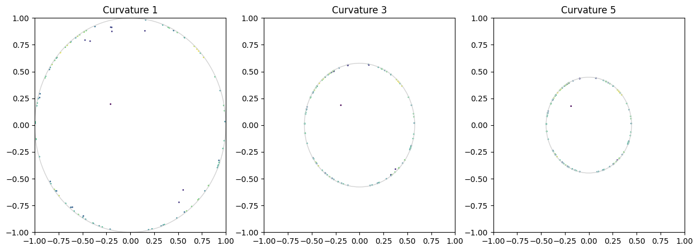
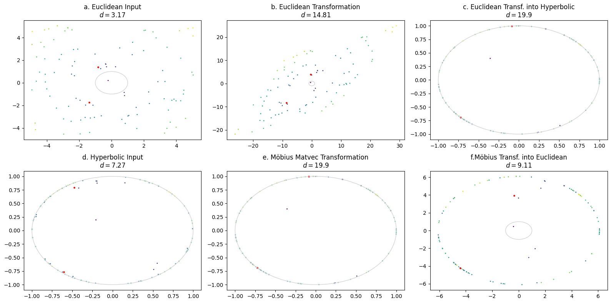

Hyperbolic Intuition
====================

This guide is about how hyperbolic features and transformations look
like, so you and I can gain an intuition about what happens (and what
can go wrong)

First, lets initialize an array of random 2-dimensional values:

.. code:: ipython3

    import torch
    import matplotlib.pyplot as plt
    
    def map_colors(values):
        import matplotlib as mpl
    
        cmap = mpl.colormaps["viridis"]
    
        values = values.pow(2).sum(dim=1).sqrt()
    
        values = values - values.min()
    
        values = values / values.max()
    
        return cmap(values)
    
    fig, ax = plt.subplots(figsize=(5,5))
    x = torch.rand(100,2) * 10
    x = x - x.mean()
    
    colors = map_colors(x)
    ax.scatter(x[:, 0], x[:, 1], s=1, c=colors)

.. parsed-literal::

    <matplotlib.collections.PathCollection at 0x7ff431240fa0>

In our next step, we will initialize a Poincaré Ball Manifold and
project the values on that manifold by using the exponentional map at
point 0 and back into the euclidean space. We will also pick out two
points so we can track how they move. And add a grey circle at the edge
of the Poincaré Disk.

.. code:: ipython3

    from torch_hyperbolic.manifolds import PoincareBall
    import math
    
    curvature = 1
    point_indices = [1, 14]
    
    ball = PoincareBall()
    x_balled = ball.expmap0(x, c=curvature)
    x_back_euclidean = ball.logmap0(x_balled, c=curvature)
    fig, axes = plt.subplots(ncols=3, nrows=1, figsize=(15,5))
    
    for ax, values, title in zip(axes, [x, x_balled, x_back_euclidean], ["Euclidean", "Hyperbolic", "Back to Euclidean"]):
        ax.scatter(values[:, 0], values[:, 1], s=1, c=colors)
        ax.scatter(values[point_indices, 0], values[point_indices, 1], s=3, c="r")
        radius = 1/math.sqrt(curvature)
        circle2 = plt.Circle((0, 0), radius, color='lightgray', fill=False)
        ax.add_patch(circle2)
        ax.set_title(title)

as you can see, our values are now on the 2-dimensional Poincaré Ball
Manifold, i.e. the Poincaré Disk. The disk has a radius of 1/sqrt(c)
where c is the curvature of the manifold. We can use different
curvatures to see that the transformation of our input values will yield
different results:

.. code:: ipython3

    ball = PoincareBall()
    curvatures = [1, 3, 5]
    
    fig, axes = plt.subplots(ncols= 3, nrows=1, figsize=(15,5))
    
    for ax, curvature in zip(axes, curvatures):    
        x_balled = ball.proj(ball.expmap0(x, c=curvature), c=curvature)
        ax.scatter(x_balled[:, 0], x_balled[:, 1], s=1,c=colors)
    
        radius = 1/math.sqrt(curvature)
        circle2 = plt.Circle((0, 0), radius, color='lightgray', fill=False)
        ax.add_patch(circle2)
        ax.set_title("Curvature {}".format(curvature))
        ax.set_ylim((-1,1))
        ax.set_xlim((-1,1))

It might look like out values have gotten closer together, especially
with higher curvature. However, distance between points increases
exponentially the closer we get to the border of the disk, so the actual
distance between points is different to what we might intuit. We can
showcase this by calculating the distances between two points in the
input space and in the three hyperbolic spaces:

.. code:: ipython3

    ball = PoincareBall()
    curvatures = [None, 1, 3, 5]
    
    point_indices = [1, 14]
    
    fig, axes = plt.subplots(ncols= 4, nrows=1, figsize=(16,4))
    
    for ax, curvature in zip(axes, curvatures):    
        if curvature is None:
            ax.scatter(x[:, 0], x[:, 1], s=1, c=colors)
            ax.scatter(x[point_indices, 0], x[point_indices, 1], s=5, c="r")
            distance_x = x[point_indices[0], 0] - x[point_indices[1], 0]
            distance_y = x[point_indices[0], 1] - x[point_indices[1], 1]
            distance = math.sqrt((distance_x ** 2) + (distance_y ** 2))
            ax.set_title("Input Space\nd={:.2}".format(distance))
        else:
            x_balled = ball.proj(ball.expmap0(x, c=curvature), c=curvature)
            ax.scatter(x_balled[:, 0], x_balled[:, 1], s=1, c=colors)
            ax.scatter(x_balled[point_indices, 0], x_balled[point_indices, 1], s=5, c="r")
            distance = math.sqrt(ball.sqdist(x_balled[point_indices[0],:], x_balled[point_indices[1], :], c=curvature))
            radius = 1/math.sqrt(curvature)
            circle2 = plt.Circle((0, 0), radius, color='lightgray', fill=False)
            ax.add_patch(circle2)
            ax.set_title("Curvature {}\nd={}".format(curvature, round(distance, 1)))
            ax.set_ylim((-1,1))
            ax.set_xlim((-1,1))

Now, lets repeat this process with two points that are closer to the
origin:

.. code:: ipython3

    ball = PoincareBall()
    curvatures = [None, 1, 3, 5]
    
    point_indices = x.pow(2).sum(dim=-1).argsort()[0:2].tolist()
    
    fig, axes = plt.subplots(ncols= 4, nrows=1, figsize=(16,4))
    
    for ax, curvature in zip(axes, curvatures):    
        if curvature is None:
            ax.scatter(x[:, 0], x[:, 1], s=1, c=colors)
            ax.scatter(x[point_indices, 0], x[point_indices, 1], s=5, c="r")
            distance_x = x[point_indices[0], 0] - x[point_indices[1], 0]
            distance_y = x[point_indices[0], 1] - x[point_indices[1], 1]
            distance = math.sqrt((distance_x ** 2) + (distance_y ** 2))
            ax.set_title("Input Space\nd={:.2}".format(distance))
        else:
            x_balled = ball.proj(ball.expmap0(x, c=curvature), c=curvature)
            ax.scatter(x_balled[:, 0], x_balled[:, 1], c=colors, s=1)
            ax.scatter(x_balled[point_indices, 0], x_balled[point_indices, 1], s=5, c="r")
            distance = math.sqrt(ball.sqdist(x_balled[point_indices[0],:], x_balled[point_indices[1], :], c=curvature))
            radius = 1/math.sqrt(curvature)
            circle2 = plt.Circle((0, 0), radius, color='lightgray', fill=False)
            ax.add_patch(circle2)
            ax.set_title("Curvature {}\nd={}".format(curvature, round(distance, 3)))
            ax.set_ylim((-1,1))
            ax.set_xlim((-1,1))

Here, we can see that the distances between the three hyperbolic spaces
are identical because the points are close to the center.

Transformations
---------------

Next, lets look at how transformations work in hyperbolic space. Linear
layers in neural networks are characterized by a multiplication of two
matrices and an optional addition of a third. Lets first start with the
matrix multiplication:

.. code:: ipython3

    from torch_hyperbolic.manifolds import PoincareBall
    ball = PoincareBall()
    parameters = torch.rand((2,2)).double()
    point_indices = [1, 14]
    
    def plot_transformations(x, parameters, point_indices):
    
            a = x.double()
    
            b = torch.mm(a, parameters)
    
            curvature = 1
    
            c = ball.proj(ball.expmap0(b, c=curvature), c=curvature)
    
            d = ball.proj(ball.expmap0(a, c=curvature), c=curvature)
    
            e = ball.proj(ball.mobius_matvec(parameters, d, c=curvature), c=curvature)
    
            f = ball.logmap0(e, c = curvature)
    
            fig, axes = plt.subplots(ncols= 3, nrows=2, figsize=(16,8))
    
            titles = ["a. Euclidean Input\n$d={}$",
                    "b. Euclidean Transformation\n$d={}$",
                    "c. Euclidean Transf. into Hyperbolic\n$d={}$",
                    "d. Hyperbolic Input\n$d={}$",
                    "e. Möbius Matvec Transformation\n$d={}$",
                    "f.Möbius Transf. into Euclidean\n$d={}$"]
    
    
            for i, (ax, values) in enumerate(zip(axes.flatten(), [a, b, c, d, e, f])):
                    ax.scatter(values[:, 0], values[:, 1], s=1, c=colors)
                    ax.scatter(values[point_indices, 0], values[point_indices, 1], s=5, c="r")
                    if i < 2 or i == 5:
                            distance_x = values[point_indices[0], 0] - values[point_indices[1], 0]
                            distance_y = values[point_indices[0], 1] - values[point_indices[1], 1]
                            distance = math.sqrt((distance_x ** 2) + (distance_y ** 2))
                    else:
                            distance = math.sqrt(ball.sqdist(values[point_indices[0],:], values[point_indices[1], :], c=curvature))
                    radius = 1/math.sqrt(curvature)
                    circle2 = plt.Circle((0, 0), radius, color='lightgray', fill=False)
                    ax.add_patch(circle2)
                    ax.set_title(titles[i].format(round(distance,2)))
    
            plt.tight_layout()
    
    plot_transformations(x, parameters, point_indices)

In these Panels, we can see our euclidean input features (a), and how
they are transformed by a matrix multiplication (b). In addition, you
see the hyperbolic representation of the input features (d) and how they
are transformed using the same parameter matrix but with a Möbius
matrix-vector multiplication. Then finally, in c, you see the projection
of the euclidean transformed features from b into the hyperbolic space,
which should resemble d, and the projection of the hyperbolic
transformed features from e into the euclidean space, which should
resemble b. In fact, we note that the shapes in b and f or c and e look
similar and the distances are similar as well, so these operations are
in fact exchangable. However, at extreme points of the manifold which
are reserved for very large values, points can get pushed together,
which then impacts their values when they are mapped back to the
euclidean space, as in frame e:

.. code:: ipython3

    plot_transformations(x, parameters*5, point_indices)

This is due to the fact that the distance between points very close to
the border are infinite, while points outside of the border are
undefined. As we want to make sure that infinite and undefined values do
not occur in a machine learning pipeline, all points very close or
across the border of the manifold are re-set onto the manifold with a
fixed distance to its border (by the ``proj()`` method of the manifold).
This can destroy the initial information of points, but it only is a
problem for very large values.

Bias Addition
-------------

.. code:: ipython3

    from torch_hyperbolic.manifolds import PoincareBall
    
    ball = PoincareBall()
    parameters = torch.rand(2,).double()
    point_indices = [1, 14]
    
    def plot_addition(x, parameters, point_indices):
    
            a = x.double()
    
            b = a + parameters
    
            curvature = 1
    
            c = ball.proj(ball.expmap0(b, c=curvature), c=curvature)
    
            d = ball.proj(ball.expmap0(a, c=curvature), c=curvature)
    
            hyperbolic_bias = ball.proj(ball.expmap0(parameters, c=curvature),c=curvature)
    
            e = ball.proj(ball.mobius_add(d, hyperbolic_bias, c=curvature), c=curvature)
    
            f = ball.logmap0(e, c = curvature)
    
            fig, axes = plt.subplots(ncols= 3, nrows=2, figsize=(16,8))
    
            titles = ["a. Euclidean Input\n$d={}$",
                    "b. Euclidean Addition\n$d={}$",
                    "c. Euclidean Add. into Hyperbolic\n$d={}$",
                    "d. Hyperbolic Input\n$d={}$",
                    "e. Möbius Additionn\n$d={}$",
                    "f. Möbius Add. into Euclidean\n$d={}$"]
    
    
            for i, (ax, values) in enumerate(zip(axes.flatten(), [a, b, c, d, e, f])):
                    ax.scatter(values[:, 0], values[:, 1], s=1, c=colors)
                    ax.scatter(values[point_indices, 0], values[point_indices, 1], s=5, c="r")
                    if i < 2 or i == 5:
                            distance_x = values[point_indices[0], 0] - values[point_indices[1], 0]
                            distance_y = values[point_indices[0], 1] - values[point_indices[1], 1]
                            distance = math.sqrt((distance_x ** 2) + (distance_y ** 2))
                    else:
                            distance = math.sqrt(ball.sqdist(values[point_indices[0],:], values[point_indices[1], :], c=curvature))
                    radius = 1/math.sqrt(curvature)
                    circle2 = plt.Circle((0, 0), radius, color='lightgray', fill=False)
                    ax.add_patch(circle2)
                    ax.set_title(titles[i].format(round(distance,2)))
    
            plt.tight_layout()
    
    plot_addition(x, parameters, point_indices)

.. image:: intuition_files/intuition_17_0.png

Here, we see the euclidean input again (a), which then gets a bias
parameter added (b). In contrast, we also see the input transformed into
the hyperbolic space (d), which is then added to the same parameter,
which has also been transformed into hyperbolic space (d). The addition
between two tensors in hyperbolic space happens via Möbius addition.
Panels c and f show the results from b and d, but transformed in the
respective other space. This means that b should resemble f and c should
resemble e. Again, in some cases, this is true, but if we increase the
magnitude of the parameters, as in the next image, this begins to fail:

.. code:: ipython3

    plot_addition(x, parameters * 10, point_indices)

Just as with the linear transformations, the high values push the points
off the manifold, after which they are re-set onto the manifold in a
fixed distance to the border to prevent infinite or undefined values.
This can destroy the information content of a point, but will only occur
for large parameters. If this acts as a kind of inherent regularization
remains to be investigated.

