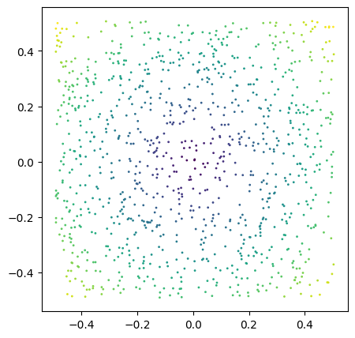

Hyperbolic Intuition II (Lorentz Model)
=======================================

This tutorial has the goal to better understand the Lorentz model, and
its accompanying manifold which is often referred to as the Hyperboloid.
In contrast to the Poincaré Ball discussed in the previous tutorial, the
Hyperboloid does not have a border where the distance between the points
reaches infinity and some other nice mathematical properties that are
adequately discussed in the literature. The most striking point about
the Lorentz Model is that it needs an additional dimension compared to
the euclidean space. I am not an expert in this, but the current model
of space-time is a Lorentz Model where the additional 0th dimension in
addition to our three euclidean dimensions of space is time. Thus, you
might see this 0th dimension referred to as time in some of the
implementations. For our case, lets start with a simple point cloud in
2-dimensional euclidean space

.. code:: ipython3

    def map_colors(values):
        import matplotlib as mpl
    
        cmap = mpl.colormaps["viridis"]
    
        values = values.pow(2).sum(dim=1).sqrt()
    
        values = values - values.min()
    
        values = values / values.max()
    
        return cmap(values)

.. code:: ipython3

    import torch
    import matplotlib.pyplot as plt
    fig, ax = plt.subplots(figsize=(5,5))
    x = torch.rand(1000,2)
    x = x - x.mean()
    colors = map_colors(x)
    ax.scatter(x[:, 0], x[:, 1], s=1, c=colors)

.. parsed-literal::

    <matplotlib.collections.PathCollection at 0x7f908bced180>

To map these onto the Hyperboloid, we need to add a third dimension at
position 0 which only contains zeros:

.. code:: ipython3

    from torch_hyperbolic.manifolds import Hyperboloid
    import math
    
    curvature = 1
    point_indices = [1, 14]
    
    ball = Hyperboloid()
    
    colors = map_colors(x)
    
    x_0 = torch.zeros((x.shape[0],)).unsqueeze(-1)
    
    x_0 = torch.cat((x_0, x), dim=-1)
    
    x_balled = ball.proj(ball.expmap0(x_0, c=curvature), c=curvature)
    x_back_euclidean = ball.proj_tan0(ball.logmap0(x_balled, c=curvature), c=curvature)
    fig = plt.figure(figsize=plt.figaspect(0.33))
    
    for i, (values, title) in enumerate(zip([x_0, x_balled, x_back_euclidean], ["Euclidean", "Hyperbolic", "Back to Euclidean"])):
        ax = fig.add_subplot(1,3,i+1, projection='3d')
        ax.scatter(values[:, 1], values[:, 2], values[:, 0], s=1, c=colors)
        ax.set_title(title)
    
    plt.tight_layout()

We see that, in contrast to the Poincaré Ball, this manifold looks like
a blanket that is being pulled up by its corners. We can chosse
different values for curvature and track how the shape of the manifold
and the distance between two given points are affected by it:

.. code:: ipython3

    curvatures = [None, 1, 5, 10]
    
    #point_indices = x.pow(2).sum(dim=-1).argsort()[0:2].tolist()
    fig = plt.figure(figsize=plt.figaspect(0.25))
    for i, curvature in enumerate(curvatures):
        ax = fig.add_subplot(1,4,i+1, projection='3d')
        if curvature is None:
            ax.scatter(x_0[:, 1], x_0[:, 2], x_0[:, 0], s=1, c=colors)
            ax.scatter(x_0[point_indices, 1], x_0[point_indices, 2], x_0[point_indices, 0], s=10, c="r")
            distance_x = x_0[point_indices[0], 0] - x_0[point_indices[1], 0]
            distance_y = x_0[point_indices[0], 1] - x_0[point_indices[1], 1]
            distance = math.sqrt((distance_x ** 2) + (distance_y ** 2))
            ax.set_title("Input Space\nd={:.2}".format(distance))
        else:
            values = ball.proj(ball.expmap0(x_0, c=curvature), c=curvature)
            ax.scatter(values[:, 1], values[:, 2], values[:, 0], s=1, c=colors)
            ax.scatter(values[point_indices, 1], values[point_indices, 2], values[point_indices, 0], s=10, c="r")
            distance = math.sqrt(ball.sqdist(values[point_indices[0],:], values[point_indices[1], :], c=curvature))
            ax.set_title("Curvature {}\nd={}".format(curvature, round(distance, 3)))
        ax.set_xlim((-1,1))
        ax.set_ylim((-1,1))

Now, we can choose two values which are closer to the center and we’ll
see that the curvature of the manifold has less of an impact on their
distance, as distance increases exponentially the further we go away
from the center:

.. code:: ipython3

    curvatures = [None, 1, 5, 10]
    
    point_indices = x.pow(2).sum(dim=-1).argsort()[0:2].tolist()
    
    fig = plt.figure(figsize=plt.figaspect(0.25))
    
    for i, curvature in enumerate(curvatures):    
        ax = fig.add_subplot(1,4,i+1, projection='3d')
        if curvature is None:
            ax.scatter(x_0[:, 1], x_0[:, 2], x_0[:, 0], s=1, c=colors)
            ax.scatter(x_0[point_indices, 1], x_0[point_indices, 2], x_0[point_indices, 0], s=10, c="r")
            distance_x = x[point_indices[0], 0] - x[point_indices[1], 0]
            distance_y = x[point_indices[0], 1] - x[point_indices[1], 1]
            distance = math.sqrt((distance_x ** 2) + (distance_y ** 2))
            ax.set_title("Input Space\nd={:.5}".format(distance))
        else:
            x_balled = ball.proj(ball.expmap0(x_0, c=curvature), c=curvature)
            ax.scatter(x_balled[:, 1], x_balled[:, 2], x_balled[:, 0], s=1, c=colors)
            ax.scatter(x_balled[point_indices, 1], x_balled[point_indices, 2], x_balled[point_indices, 0], s=10, c="r")
            distance = math.sqrt(ball.sqdist(x_balled[point_indices[0],:], x_balled[point_indices[1], :], c=curvature))
            ax.set_title("Curvature {}\nd={}".format(curvature, round(distance, 5)))
            ax.set_ylim((-1,1))
            ax.set_xlim((-1,1))

Linear Transformations
----------------------

Now, let’s see how linear transformations such as matrix multiplication
affects the point cloud and the manifold:

.. code:: ipython3

    parameters = torch.rand((3,3)).double()
    point_indices = [1, 14]
    
    
    def plot_transformations(x, parameters, point_indices):
            
            curvature = 10
    
            a = x_0.double()
    
            b = torch.mm(a, parameters)
            
            b[:, 0] = 0
            
            c = ball.proj(ball.expmap0(b, c=curvature), c=curvature)
    
            d = ball.proj(ball.expmap0(a, c=curvature), c=curvature)
    
            e = ball.proj(ball.mobius_matvec(parameters, d, c=curvature), c=curvature)
    
            f = ball.logmap0(e, c = curvature)
    
            f[:, 0] = 0
    
            titles = ["a. Euclidean Input\n$d={}$",
                    "b. Euclidean Transformation\n$d={}$",
                    "c. Euclidean Transf. into Hyperbolic\n$d={}$",
                    "d. Hyperbolic Input\n$d={}$",
                    "e. Möbius Matvec Transformation\n$d={}$",
                    "f.Möbius Transf. into Euclidean\n$d={}$"]
    
            fig = plt.figure(figsize=plt.figaspect(0.4))
    
            for i, values in enumerate([a, b, c, d, e, f]):
                    ax = fig.add_subplot(2,3,i+1, projection='3d')
                    ax.scatter(values[:, 1], values[:, 2], values[:, 0], s=1 , c=colors)
                    ax.scatter(values[point_indices, 1], values[point_indices, 2], values[point_indices, 0], s=10, c="r")
                    if i < 2 or i == 5:
                            distance_x = values[point_indices[0], 1] - values[point_indices[1], 1]
                            distance_y = values[point_indices[0], 2] - values[point_indices[1], 2]
                            distance = math.sqrt((distance_x ** 2) + (distance_y ** 2))
                    else:
                            distance = math.sqrt(ball.sqdist(values[point_indices[0],:], values[point_indices[1], :], c=curvature))
                    ax.set_title(titles[i].format(round(distance,2)))
    
            plt.tight_layout()
    
    plot_transformations(x, parameters, point_indices)

Here we see our input in euclidean space (a), which is transformed by a
matrix multiplication (b). We also see the input transformed into the
hyperbolic space (d), tand then transformed (e). We can see that the
matrix multiplication affects the point cloud similarly in both spaces,
and that the procedure is equivalent by comparing b with d and e with
c. In fact, the Mobius Matrix-Vector multiplication implemented in the
Hyperboloid simply maps the input from the hyperbolic to the euclidean
space, does matrix multiplication there and maps it back again. Just
like the Poincaré Ball, very large values are offset to a fixed distance
to prevent the occurence of infinite or undefined values:

.. code:: ipython3

    plot_transformations(x, parameters*100, point_indices)

Bias Addition II
----------------

Another normal building block of neural networks are bias additions. We
can to the bias addition in the euclidean space and then project the
values into the hyperbolic space or do it directly in hyperbolic space
via the Möbius addition:

.. code:: ipython3

    from torch_hyperbolic.manifolds import Hyperboloid
    
    ball = Hyperboloid()
    parameters = torch.rand(3,).double()
    point_indices = [1, 14]
    
    def plot_addition(x, parameters, point_indices):
            
            curvature = 10
    
            a = x.double()
    
            parameters = ball.proj_tan0(parameters.squeeze().view(1, -1), c=curvature)
    
            b = a + parameters
    
            c = ball.proj(ball.expmap0(b, c=curvature), c=curvature)
    
            d = ball.proj(ball.expmap0(a, c=curvature), c=curvature)
    
            hyperbolic_bias = ball.proj(ball.expmap0(parameters, c=curvature),c=curvature)
    
            e = ball.proj(ball.mobius_add(d, hyperbolic_bias, c=curvature), c=curvature)
    
            f = ball.logmap0(e, c = curvature)
    
            f = ball.proj_tan0(f, c = curvature)
    
            fig = plt.figure(figsize=plt.figaspect(0.47))
    
            titles = ["a. Euclidean Input\n$d={}$",
                    "b. Euclidean Addition\n$d={}$",
                    "c. Euclidean Add. into Hyperbolic\n$d={}$",
                    "d. Hyperbolic Input\n$d={}$",
                    "e. Möbius Addition\n$d={}$",
                    "f. Möbius Add. into Euclidean\n$d={}$"]
    
            for i, values in enumerate([a, b, c, d, e, f]):
                    ax = fig.add_subplot(2,3,i+1, projection='3d')
                    ax.scatter(values[:, 1], values[:, 2], values[:, 0], s=1, c=colors)
                    ax.scatter(values[point_indices, 1], values[point_indices, 2],  values[point_indices, 0],  s=3, c="r")
                    if i < 2 or i == 5:
                            distance_x = values[point_indices[0], 0] - values[point_indices[1], 0]
                            distance_y = values[point_indices[0], 1] - values[point_indices[1], 1]
                            distance = math.sqrt((distance_x ** 2) + (distance_y ** 2))
                    else:
                            distance = math.sqrt(ball.sqdist(values[point_indices[0],:], values[point_indices[1], :], c=curvature))
                    ax.set_title(titles[i].format(round(distance,2)))
    
            plt.tight_layout()
    
    plot_addition(x_0, parameters, point_indices)

However, when we compare b with f and c with e, we can see that the two
procedures are not equivalent, although the literature suggests it.
although e looks comparable to c, the distance between the two selected
points and the absolute values are different. It is, however, also
possible to use the hyperbolic layers implemented in pytorch_geometric
withou bias addition.

